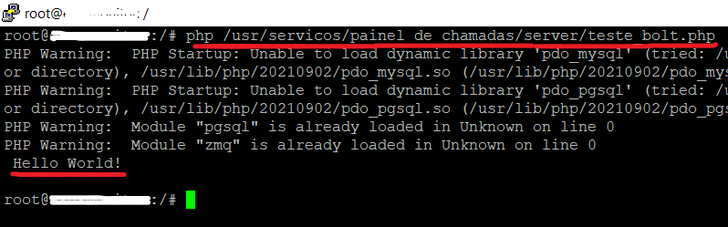
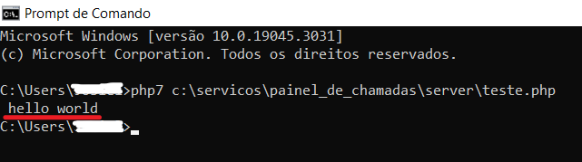

# 🎯 Painel de Chamadas para e-SUS PEC

<p align="center">
  <em>Painel de Chamadas para e-SUS PEC fornece a aplicação server-side/client-side completa e 100% em modo leitura do banco de dados PostgreSQL.<br/>Fique à vontade para personalizar a aplicação cliente fornecida ou apenas depurar e criar sua própria aplicação cliente.</em>
</p>

[](https://youtu.be/JppBKXHPz9Y)

## ✏️ Pré-requisitos

1. Instalação Apache + PHP;
2. Composer;
3. Faça download do projeto;
4. Mova a pasta `server` para qualquer local desejado. NÃO COLOQUE DENTRO DO SERVIDOR WEB APACHE/HTDOCS:
```
# windows
c:\servicos\painel_de_chamadas
```
```
# linux/ubuntu
/usr/servicos/painel_de_chamadas
```
5. Mova a pasta `cliente` para dentro do seu servidor web:
```
# windows
c:\xampp\htdocs\painel_de_chamadas
```
```
# linux/ubuntu
/var/www/html/painel_de_chamadas
```
6. Faça o download da extensão loader `bolt.so` ou `php_bolt.dll`: **[phpBolt.com](https://phpbolt.com/wp-content/uploads/2023/03/phpBolt-extension-1.0.4.zip)**

Nota: se o seu sistema operacional não estiver listado entre as versões da extensão, A APLICAÇÃO NÃO FUNCIONARÁ.

## ⚡ Instalação do SERVIDOR (ubuntu)

<details><summary>👉 click aqui</summary>

#### Exemplo usando php8.1

* Edite seu `php.ini` em `/etc/php/8.1/apache2` ou `/etc/php/8.1/cgi` ou `/etc/php/8.1/cli` ou `/etc/php/8.1/fpm`. Se você não conhece como seu servidor está configurado, edite todos estes arquivos adicionando apenas `extension=bolt` ao final do arquivo para evitar qualquer erro.

Nota: o serviço `php8.1-fpm` é apenas para instalações que o possuam. Se você executa apache + php e não possui o serviço mencionado, pule-o em cada etapa.

* Copie a extensão loader `bolt.so` de acordo com a arquitetura do seu sistema operacional e versão do php para `/usr/lib/php/20210902`.

* Para verificar se a extensão foi configurada corretamente, reinicie o serviço `apache2` e `php8.1-fpm`, então execute:
```
php /usr/servicos/painel_de_chamadas/server/teste.php
```
Você deve obter um resultado `Hello Word!` como esse:
<div align="center">
    
</div>

##### Se houver erro, refaça os procedimentos. Então, continue.

* Instale as dependências do projeto com o composer:
```
cd /usr/servicos/painel_de_chamadas/server/
composer install
```

##### Se houver erro, refaça os procedimentos. Então, continue.

* Agora, certifique-se de possuir as credenciais de acesso ao servidor PostgreSQL. Edite o arquivo `config.json`
```
nano config.json
```
Forneça credenciais somente leitura, por segurança.

Nota: a variável `server_port` é do novo servidor que estamos configurando e pela qual ele irá fornecer as informações. As demais são do servidor do banco de dados.

* Se você instalou a extensão e configurou as variáveis corretamente, está pronto para iniciar o servidor. Execute:
```
php server.php
```

</details>

[](https://youtu.be/JHSxVfDWX7I)


## 🕔 Instalação do SERVIDOR (windows)

<details><summary>👉 click aqui</summary>

#### Exemplo usando o php7.4

* Se sua instalação for no windows, é provável que sua versão php seja superior a 7.4. Portanto, faça o download em: **[php7.4](https://windows.php.net/downloads/releases/)**

Nota: verifique se você está executando uma versão TS ou NTS e baixe o arquivo correspondente.

* Extraia os arquivos em c:\xampp\php7

* Renomeie o executável `php.exe` para `php7.exe`

* Faça um backup de `php.ini-development` e renomeie para `php.ini` e edite-o descomentando e adicionando o que for necessário:
```
extension_dir = "ext"
extension=curl
extension=fileinfo
extension=exif
extension=pdo_mysql
extension=pdo_pgsql
extension=pgsql
extension=bolt
```

* Defina a configuração para execução do php7.4 editando `c:\xampp\apache\conf\extra\httpd-xampp.conf` adicionando ao final do arquivo:
```
ScriptAlias /php7/ "C:/xampp/php7/"
<Directory "C:/xampp/php7">
     AllowOverride None
     Options None
     Require all denied
   <Files "php-cgi.exe">
     Require all granted
   </Files>
</Directory>

Listen 8070
<VirtualHost *:8070>
     UnsetEnv PHPRC
   <FilesMatch "\.php$">
     php_flag engine off
     SetHandler application/x-httpd-php7
     Action application/x-httpd-php7 "/php7/php-cgi.exe"
   </FilesMatch>
</VirtualHost>
```

Nota: aqui nós definimos a porta 8070 para a execução do php7.4. Dessa forma, o php7 será executado nesta porta com o apache. Se você executar um `phpinfo();` nesta porta, verá os dados dessa versão. Se você suprimir essa porta, verá os dados de uma versão instalada anteriormente, se for o caso.

IMPORTANTE: não confunda a porta de execução do php7 com a porta que ele estará fornecendo os dados.

* REINICIE o servidor Apache.

* Copie a extensão loader `php_bolt.dll` de acordo com a versão do php para `c:\xampp\php7\ext`.

* Adicione uma nova variável de ambiente do tipo PATH para o php7.4:
```
c:\xampp\php7
```

* Agora, teste se o php7.4 está configurado corretamente. Abra o `cmd` e execute:
```
php7 --version
```

* Se deu certo, agora teste se a extensão loader está configurada corretamente:
```
php7 c:\servicos\painel_de_chamadas\server\teste.php
```
Você deve obter um resultado `Hello Word!` como esse:
<div align="center">
    
</div>

##### Se houver erro, refaça os procedimentos. Então, continue.

* Abra o arquivo `composer.json` em `c:\servicos\painel_de_chamadas\server\` e adicione a configuração para o php7.4:
```
{
  "require": {
      "cboden/ratchet": "^0.4.3",
      "react/socket": "^1.13",
      "react/event-loop": "^1.4",
      "react/stream": "^1.1.1"
  },
  "config": {
    "platform": {
        "php": "7.4.33"
    }
  }
}
```

* Instale as dependências do projeto com o composer:
```
cd c:\servicos\painel_de_chamadas\server\
composer install
```

##### Se houver erro, refaça os procedimentos. Então, continue.

* Agora, certifique-se de possuir as credenciais de acesso ao servidor PostgreSQL. Edite o arquivo `config.json`. Forneça credenciais somente leitura, por segurança.

Nota: a variável `server_port` é do novo servidor que estamos configurando e pela qual ele irá fornecer as informações. As demais são do servidor do banco de dados.

* Se você instalou a extensão e configurou as variáveis corretamente, está pronto para iniciar o servidor. Execute:
```
php7 server.php
```

</details>

[](https://youtu.be/5r_So6NT_p4)


## 💻 Configurando a aplicação cliente

<details><summary>👉 click aqui</summary>

* Entre em `c:\xampp\htdocs\painel_de_chamadas\cliente` ou `/var/www/html/painel_de_chamadas/cliente` e edite o arquivo `config.json`.

Nota: a variável `server_port` e a mesma que configuramos no lado do servidor, enquanto `server_host` é o host onde o php está servindo os dados: `localhost`.

* Abra a aplicação cliente no navegador `localhost/painel_de_chamadas/cliente` e verifique o console, que dirá se a conexão com o servidor foi bem sucedida.

Nota: como você pode verificar, a aplicação cliente usa programação procedural. Ainda assim, o lado servidor já está em POO.

</details>

[](https://youtu.be/8MnedSUn6m4)

## Cliente com SSL

[](https://youtu.be/1fZNQ4f96W0)

## ➿ Instale o servidor como um serviço

* Para não ter que iniciar o servidor manualmente, instale o arquivo `server.php` como um serviço no sistema.

## 😘 Contribua
* Contribua e receba a licença VITALÍCIA. Apenas **R$ 23,00** para ajudar a manter o projeto.

* **CHAVE PIX => 95988028564**

* Você ainda pode personalizar sua aplicação cliente da forma que desejar.

Nota: se você chegou até o fim, o servidor e cliente estão se comunicando perfeitamente. Mas as informações só serão transmitidas com o arquivo da licença.

# UPDATES
### v4.0b1
* bugFix e melhorias

### v3.1
* Reformulação completa da aplicação cliente:
```
- Fullscreen automático 😉
- Vídeos locais ou Youtube, com play e pause automáticos 🚀
- Lista de espera 👏🏼
- Histórico de chamadas, com status (em atendimento, chamada não atendida e atendimento finalizado) 😉
- Classificação de risco colorida 👨‍🦼
- Layout personalizável 😎
- Consumo mínimo de recursos 🚀
- Segurança com PIN para habilitar um novo dispositivo 📲
- Configuração protegida por senha (sem banco de dados) 🤫
- Painéis separados por unidade de saúde 😱
```
**Substitua o diretório ```cliente```!**

* Adequação do Server
**Substitua apenas ```config.json``` e ```server.php```. Sua licença ```source.php``` permanece válida!**

* VERIFIQUE NOVAMENTE AS CONFIGURAÇÕES DE CONEXÃO EM AMBOS OS ARQUIVOS ```config.json```